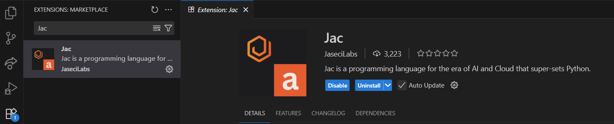
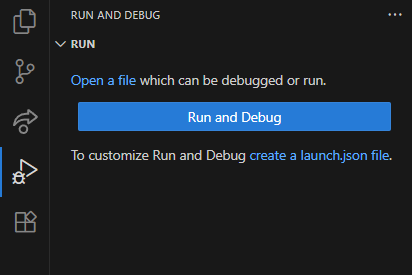
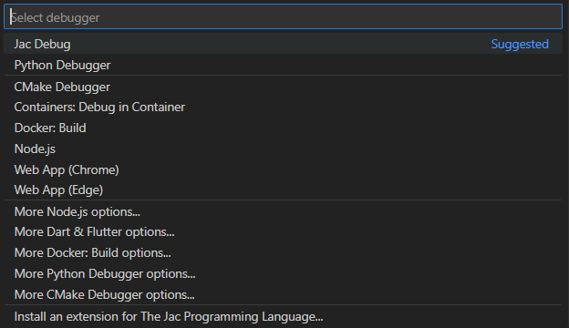
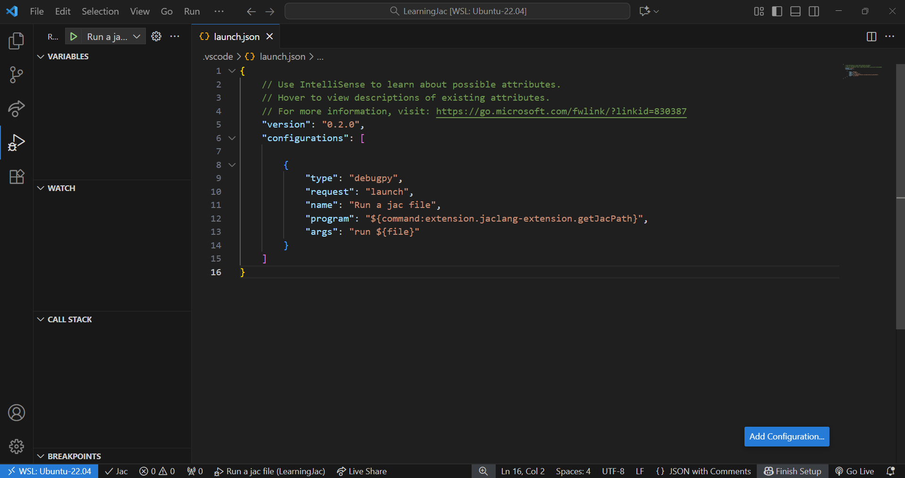
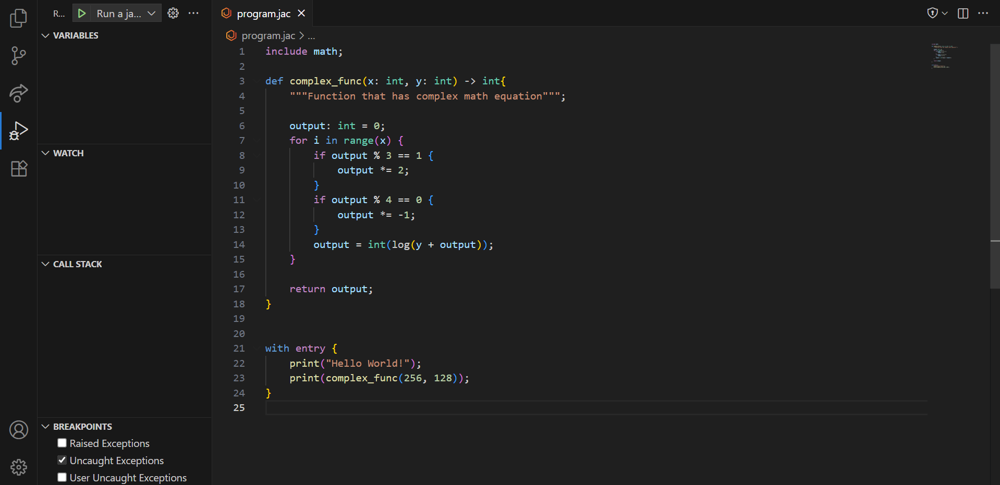
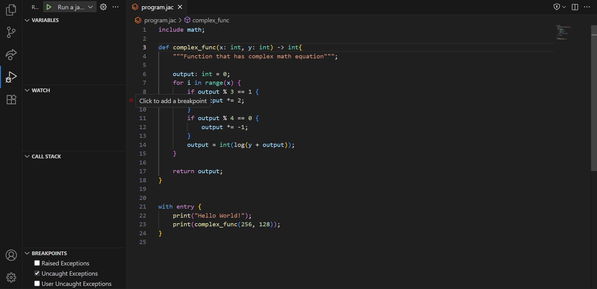
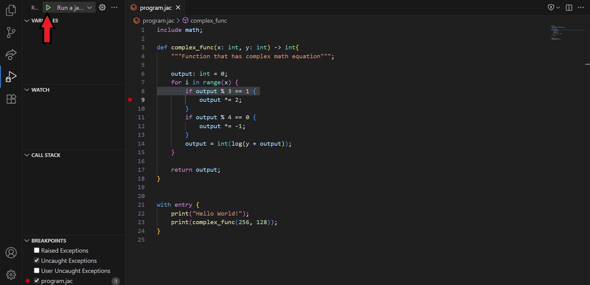
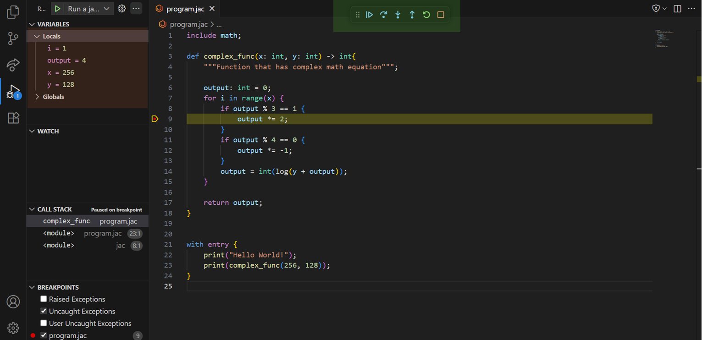
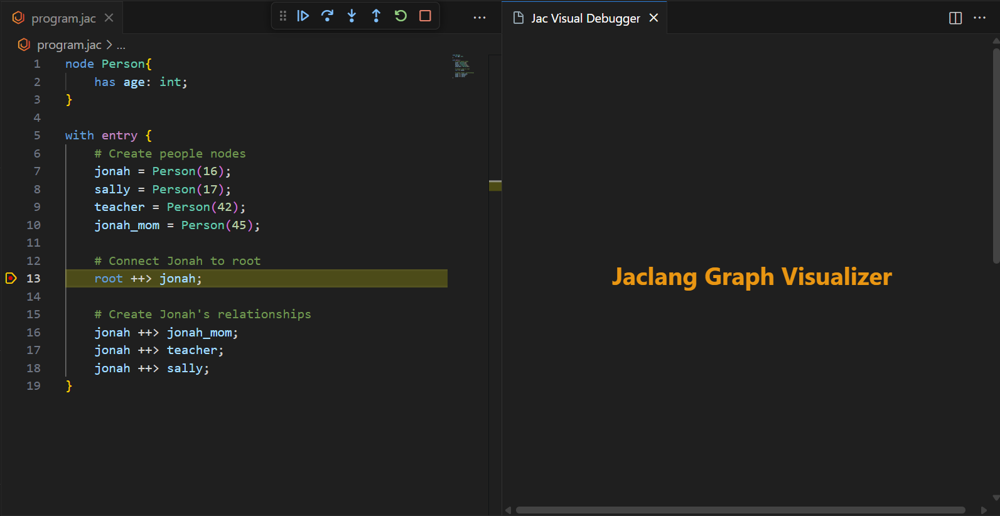
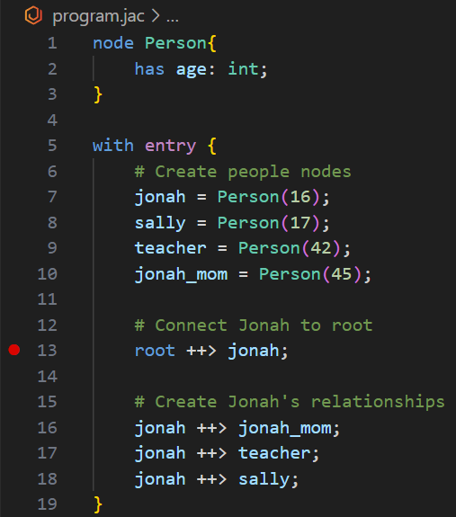

# Jac debugging in VS Code

---
The first step in debugging a Jac program is deciding if you are using the online debugger with the [Jac Playground](https://www.jac-lang.org/playground/) or the VS Code Extension to debug on your own machine. 

In this tutorial we will cover how to setup and fully utilize the VS Code debugger. 

If you want to learn more about the online debugger check out the [Jac Playground Tutorial](https://www.jac-lang.org/learn/jac_playground/). 

!!! info
    You can write and run Jac code in any text editor, but currently, debugging is only supported in Visual Studio Code using the official Jac extension.
    This extension offers features such as breakpoints, syntax highlighting, error checking, and graph visualization.

## Setup (one time)
---

!!! info
    This is the information to set up the tools to use the Jac debugger. These steps should be followed ONLY ONCE.

!!! important
    To get started, you will need Python 3.12 or later and jaclang 0.8.10 or later installed.

### Jac Environment Setup

Before following this tutorial, make sure you have read the [Jac Installation Guide](https://www.jac-lang.org/learn/installation/) for details on setting up your first Jac environment.

### Visual Studio Code Setup

Make sure you have VS Code text editor installed on your device. 

If you do not have it installed go to [Visual Studio Code](https://code.visualstudio.com/) to install the program.

Once, installed follow the video below:

1. Open settings menu
2. Search for "breakpoints"
3. Select `Debug: Allow Breakpoints Everywhere`

_TODO: insert video here_
<video width="640" height="360" controls>
  <source src=".assets/debugger/1030.mp4" type="video/mp4">
  Your browser does not support the video tag.
</video>

### Jac Debugger Setup

Once VS Code is installed, go to the extensions tab and search `jac` and install the following extension:

{: style="display: block; margin: auto;"}


## Setup (every time)

!!! info
    These steps should be followed EVERY time you create a new Jac project.

### Setting up launch.json

A `launch.json` file is a vscode configuration file that tells the debugger how to run the program (i.e. what args to pass in, what version of Jac to use, etc.)

First opening the `Run and Debug` menu on the VS Code tool bar, selecting we want to `create a launch.json file`.


{: style="display: block; margin: auto;"}


This will open a menu prompting you to select which templated `launch.json` to create. We want to select `Jac Debug`.


{: style="display: block; margin: auto;"}


This will create the templated `launch.json` file and your screen should look something like this


{: style="display: block; margin: auto;"}


If you see this screen you successfully set up your Jac Debugger!

## Debugger Tutorial

--

Below are some examples of how to use the Jac Debugger 

### Breakpoints
!!! note
    This tutorial assumes you've never used a debugger. If you feel comfortable using a debugger skip to the [Graph Visualizer Tutorial Section](#graph-visualizer)

Below we have a basic example of a jac program with a function `complex_func` we want to debug.

{: style="display: block; margin: auto;"}

Lets say we are unsure of when line 9 runs and we want to use the debugger. We can set a breakpoint on that line by clicking on the circle that appears when we hover next to the line number

{: style="display: block; margin: auto;"}


Once we set the breakpoint we can run the program with the debugger to better understand the program. Press the green run button in the `Run and Debug` on the top left of the toolbar


{: style="display: block; margin: auto;"}

Now that the debugger is running with our breakpoint, whenever the program is executing reaches a line with a breakpoint it will halt and show you with the menu below. 

#### Debugger Options (in green):

- Continue: Run until next breakpoint or program ends.
- Step Over: Execute the next line (skip over function calls).
- Step Into: Execute the next line or enter called functions.
- Step Out: Run until the current function returns.
- Restart: Rerun the program from the start.
- Stop: Halt the program and exit the debugger.

#### Variable Viewer (in red):

These are the current values of all local and global variables the program is using when running. Use these to understand what is happening and what is the state of the program at any given breakpoint.



### Graph Visualizer

!!! note
    This tutorial assumes you DO know how to use a debugger. If you do NOT feel uncomfortable using a debugger go back to the [Breakpoints Tutorial Section](#Breakpoints)

Now that we have the debugger working we can use the graph visualizer to better represent the graph.

Below is a code snippet of the graph we will be using. This graph will be representing who knows each other.

We can create a graph by adding some connections like:
```jac
node Person{
    has age: int;
}

with entry {
    # Create people nodes
    jonah = Person(16);
    sally = Person(17);
    teacher = Person(42);
    jonah_mom = Person(45);

    # Connect Jonah to root
    root ++> jonah;

    # Create Jonah's relationships
    jonah ++> jonah_mom;
    jonah ++> teacher;
    jonah ++> sally;
}
```


First we want to open the visualization tool:

1. Open the VS Code Command Palette
    This can be done by either:
    - On your keyboard pressing `ctrl+shift+p` 
    - On the top menu bar pressing `view > command palette`

2. Type `jacvis` and clicking on the option labeled `jacvis: Visualize Jaclang Graph`

    This should open up a side bar window that looks like the below:

    

Next we can set a break point in our code as shown below. Then we run the debugger and it should stop at the line below.



Then we can step through the program as normal and new nodes should appear as follows:

_TODO: insert video here_
<video width="640" height="360" controls>
  <source src=".assets/debugger/1030.mp4" type="video/mp4">
  Your browser does not support the video tag.
</video>


As shown in the video, these nodes will show their values and can be dragged around to better visualize the data. 

